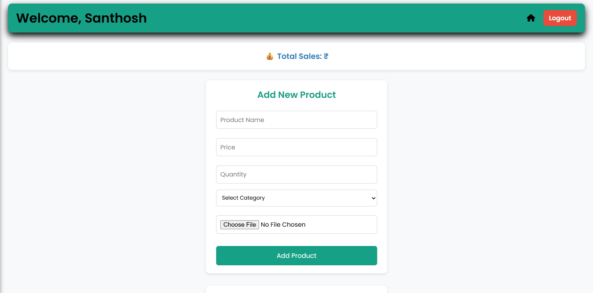
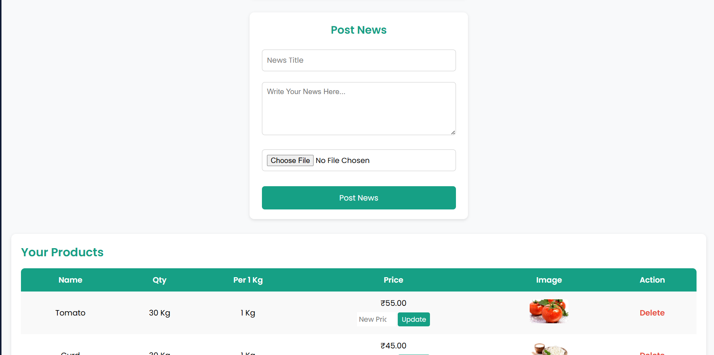
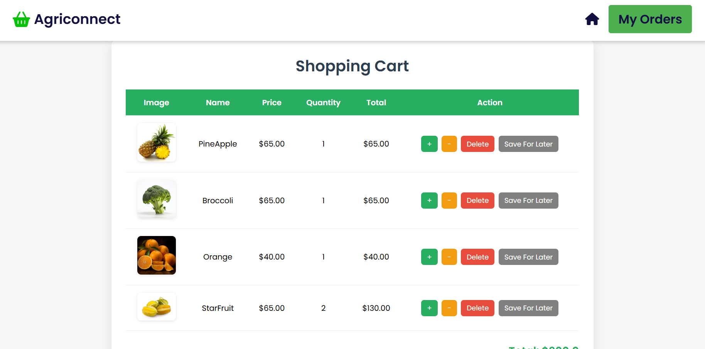

# Agrreconnect_web


#🌾 AgriConnect – Farmer Support & Market Linkage Portal

**AgriConnect** is a web-based platform designed to connect farmers directly with buyers, provide market price updates, and offer agricultural support services. The system helps eliminate middlemen and improve farmer income.

This project is built using Flask (Python) for backend and HTML/CSS/JavaScript for frontend.

##🚀 Features
*👨‍🌾 Farmer Registration & Login
*🔐 Google OAuth Login Integration
*📦 Product Listing by Farmers
*🛒 Buyer Product Browsing
*📊 Market Price Information
*📁 Secure Authentication System
*🗂 Database Integration (SQLite/MySQL)
*🔒 Environment-based secret protection

## 🛠️ Tech Stack

* **Backend:** Python 3.10+, Flask Framework
* **Database:** MySQL
* **Frontend:** HTML5, CSS3, JavaScript, Jinja2 Templates
* **Libraries:**
    * `mysql-connector-python` (Database Connection)
    * `smtplib` (Email Services)


📂 Project Structure
Agreconnect_web/
│
├── project.py
├── templates/
├── static/
├── .env (ignored)
├── .gitignore
└── README.md


##⚙️ Installation Guide
### 1️⃣ Clone the Repository
```bash
git clone https://github.com/Nilamani77/Agrreconnect_web.git
cd Agrreconnect_web
```

### 2️⃣ Create Virtual Environment
*python -m venv venv
*venv\Scripts\activate   # Windows

### 3️⃣ Install Dependencies
```bash
pip install -r requirements.txt
```

### 4️⃣ Create .env File
*Create a .env file in the root folder:
```bash
GOOGLE_CLIENT_ID=your_client_id
GOOGLE_CLIENT_SECRET=your_client_secret
```

### ▶️ Run the Application
```bash
python project.py
```
```bash
Open browser:
http://127.0.0.1:5000
```

### 🔐 Security
*OAuth credentials stored using environment variables
```bash
.env file excluded using .gitignore
No hardcoded secrets
```

### 🎯 Future Enhancements
*Payment Gateway Integration
*Admin Dashboard
*AI-based Crop Recommendation
*Real-time Market Price API
*Deployment on Cloud (AWS/Render)

### 👤 Author
*Nilamani Kundu
*B.Tech CSE (AI & ML)
* **GitHub**: https://github.com/Nilamani77

## 📸 Screenshots
```bash
1️⃣ Login_Page

```
```bash
2️⃣Home_page

```
```bash
3️⃣Farmer_page


```
```bash
4️⃣Cart_Page

```
